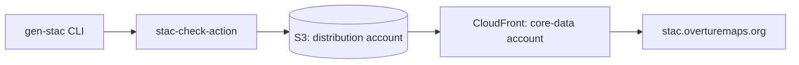

# Publishing architecture

`publish-catalog.yaml` builds the production STAC catalog with this repo's own `overture-stac` CLI, validates it, and publishes it to `stac.overturemaps.org`, all without leaving GitHub Actions.

## Overall architecture

## Data flow

A run has three stages, always in this order:

1. `gen-stac --output public_releases` walks every release currently in the public registry bucket and writes the catalog to a working directory.
2. `stac-check-action` validates the result against the STAC spec before anything gets published, using `fast-linting` for speed since this runs on the schedule.
3. The validated catalog is synced to S3 and the CDN cache in front of it is invalidated.

The build stage runs unauthenticated: it only reads public data and needs no AWS credentials. Publishing is where the workflow needs to touch two separate AWS accounts, which is the part worth understanding before changing anything here.

## Why two AWS accounts

The bucket that serves `stac.overturemaps.org` and the CloudFront distribution in front of it live in different AWS accounts, split along Overture's existing account boundaries rather than anything specific to this workflow:

- The distribution account owns `overturemaps-extras-us-west-2`, the S3 bucket the catalog is synced into under the `stac/` prefix.
- The core-data account owns the CloudFront distribution that fronts `stac.overturemaps.org` and caches what's in that bucket.

## Triggers and gating

`publish-catalog.yaml` runs on a `schedule` (every 6 hours) and on `workflow_dispatch`. Both triggers share one `publish` job; what differs is the job's `environment`, set via `${{ github.event_name == 'workflow_dispatch' && 'manual-publish' || '' }}`. An empty string evaluates to no environment, so the scheduled run publishes straight through, while a manual dispatch is gated behind the `manual-publish` environment's required reviewer approval.
